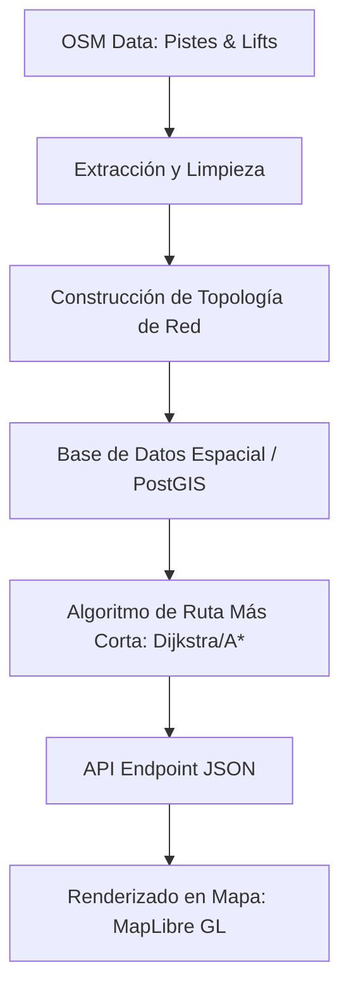

# Plan de Enrutamiento en Estaciones de Esquí (Ski Routing System)

Para implementar un sistema de navegación/enrutamiento que guíe a un usuario desde su posición actual (o un punto inicial) hasta una pista o remonte seleccionado a través de la red de pistas y remontes existentes (y no trazando una línea recta sobre la montaña), debemos modelar el dominio como un **Grafo Dirigido Acíclico (o parcialmente cíclico debido a remontes/telesillas)**.

A continuación se detalla la arquitectura, el procesamiento de datos de OpenStreetMap (OSM) y la estrategia de implementación para lograrlo.

---

## 1. Concepto Fundamental: Grafo de Red de Esquí (Ski Network Graph)

No podemos usar algoritmos de enrutamiento estándar de carreteras (como el perfil de coche de OSRM) porque el esquí tiene reglas físicas e infraestructuras muy particulares:
- **Pistas (Pistes):** Son unidireccionales de bajada (determinadas por la gravedad/pendiente).
- **Remontes (Lifts):** Son unidireccionales de subida (telesillas, telecabinas, telesquís).
- **Conectores pedestres:** Zonas llanas de transición donde el esquiador puede avanzar en cualquier dirección caminando o empujándose.

### Representación en Grafo:
*   **Nodos (Vertices):**
    *   Puntos de intersección entre pistas.
    *   Estaciones de inicio (base) y fin (retorno) de los remontes.
    *   Puntos de inicio y fin de cada pista física.
*   **Aristas (Edges):**
    *   Segmentos de pistas (dirección: cuesta abajo).
    *   Tramos de remontes (dirección: cuesta arriba).
    *   Conectores o caminos de enlace.

---

## 2. Flujo de Trabajo Técnico (Pipeline de Datos)



### Paso A: Extracción y Limpieza de Datos (OSM)
OpenStreetMap define las pistas y remontes mediante las siguientes etiquetas clave:
- **Pistas:** `piste:type=downhill` (esquí alpino), `piste:difficulty=*` (novice, easy, intermediate, advanced).
- **Remontes:** `aerialway=chair_lift`, `aerialway=drag_lift`, `aerialway=gondola`, etc.

### Paso B: Creación de la Topología de Red (Backend o DB)
Para que los caminos se conecten de forma lógica, debemos unir los extremos que coinciden espacialmente:
1.  **Ajuste espacial (Snapping):** Las geometrías de OSM a veces tienen pequeñas desconexiones de centímetros. Debemos agrupar (hacer *snap*) los vértices que estén a menos de una distancia umbral (ej. 2 a 5 metros) para convertirlos en un único Nodo compartido.
2.  **Determinación del sentido de las pistas:**
    *   Los remontes ya vienen dibujados en la dirección del viaje en OSM.
    *   Las pistas de esquí deben orientarse estrictamente hacia abajo. Usando un modelo de elevación digital (DEM) como SRTM o datos de elevación del terreno en el backend, asignamos el sentido del nodo con mayor altitud al nodo con menor altitud.
3.  **Coste de Arista (Weight / Impedance):**
    El peso de cada arista no debe ser solo la distancia en metros. Se calcula mediante:
    $$\text{Coste} = \text{Distancia} \times \text{Factor Dificultad} + \text{Tiempo de espera (en remontes)}$$
    *   **Remontes:** Se les puede asignar una penalización de tiempo fija (ej. 3-5 minutos de cola + tiempo de subida) para evitar que el algoritmo proponga coger 5 remontes seguidos si se puede bajar esquiando.
    *   **Dificultad ajustable:** Si el usuario es principiante, podemos asignar un peso infinito o muy alto a las pistas negras (`difficulty=advanced`/`expert`), forzando al algoritmo a buscar alternativas verdes o azules.

---

## 3. Estrategias de Implementación

Tienes tres opciones principales para implementar el motor de enrutamiento, ordenadas de menor a mayor complejidad/personalización:

### Opción 1: pgRouting en PostgreSQL (Recomendado)
Dado que tu backend está en Go y probablemente almacenes datos geográficos en PostgreSQL/PostGIS, la extensión **pgRouting** es ideal.
- **Ventajas:** Maneja la topología espacial directamente en la base de datos con funciones listas como `pgr_dijkstra` o `pgr_astar`.
- **Implementación:**
  1. Importas los datos de OSM con `osm2pgrouting`.
  2. Creas la topología de red con `pgr_createTopology`.
  3. Ejecutas la consulta SQL pasando el nodo origen y destino:
     ```sql
     SELECT * FROM pgr_dijkstra(
       'SELECT id, source, target, length_m AS cost FROM ski_network_edges',
       start_node_id, end_node_id, directed := true
     );
     ```
  4. La consulta devuelve una secuencia de geometrías (LineStrings) que el backend de Go puede unir en un GeoJSON `FeatureCollection` y enviar al frontend.

### Opción 2: Motor de Enrutamiento en Memoria en Go
Si prefieres no depender de extensiones pesadas en la base de datos, puedes construir la red en memoria en tu API de Go al iniciar el servidor.
- **Ventajas:** Extremadamente rápido y fácil de desplegar.
- **Implementación:**
  1. Al iniciar la aplicación, cargas todas las pistas y remontes desde la base de datos.
  2. Construyes un grafo en memoria utilizando librerías de Go para grafos (ejemplo: `gonum/graph` o un mapa personalizado `map[int64][]Edge`).
  3. Implementas Dijkstra o A* (donde la heurística de A* es la distancia euclidiana 2D/3D hacia el destino).
  4. Expón un endpoint en tu API: `/api/route?start_lat=X&start_lon=Y&end_resort_feature_id=Z`.

### Opción 3: Valhalla / OSRM con perfil personalizado (Escalable)
Motores de enrutamiento profesionales de código abierto.
- **Ventajas:** Altamente optimizados para grandes volúmenes de datos.
- **Implementación:** Requiere configurar un contenedor de Valhalla y escribir un perfil de enrutamiento en Lua que comprenda las etiquetas `piste:type` y `aerialway` para prohibir subir pistas o bajar remontes. Es más complejo de mantener para una sola estación.

---

## 4. Cómo integrarlo en el Frontend (MapLibre GL / React)

Una vez que tengas el endpoint `/api/route` listo en el backend que devuelve el GeoJSON de la ruta calculada:

1.  **Selección del destino:** Cuando el usuario hace clic en una pista o remonte en el mapa, obtienes su identificador o coordenadas medias.
2.  **Obtención del origen:** Obtienes la ubicación GPS actual del usuario (usando `expo-location` si estás en móvil, o la geolocalización del navegador).
3.  **Llamada a la API:**
    ```javascript
    const response = await axios.get(`${API_BASE_URL}/route`, {
        params: {
            from_lat: userLocation.latitude,
            from_lon: userLocation.longitude,
            target_feature_id: selectedFeature.id
        }
    });
    ```
4.  **Dibujar en el mapa:**
    Añades una fuente (`Source`) y una capa de tipo línea (`Layer`) en tu mapa de MapLibre utilizando el GeoJSON recibido:
    ```typescript
    // En tu componente de MapLibre (InteractiveSkiMap)
    const routeGeoJSON = response.data; // GeoJSON LineString
    
    // Configuras la fuente
    map.addSource('calculated-route', {
        type: 'geojson',
        data: routeGeoJSON
    });

    // Añades la capa con un estilo vistoso (línea azul brillante discontinua)
    map.addLayer({
        id: 'route-layer',
        type: 'line',
        source: 'calculated-route',
        layout: {
            'line-join': 'round',
            'line-cap': 'round'
        },
        paint: {
            'line-color': '#00bcd4',
            'line-width': 5,
            'line-dasharray': [2, 2]
        }
    });
    ```
