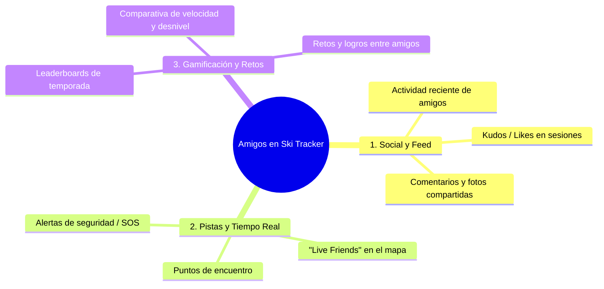
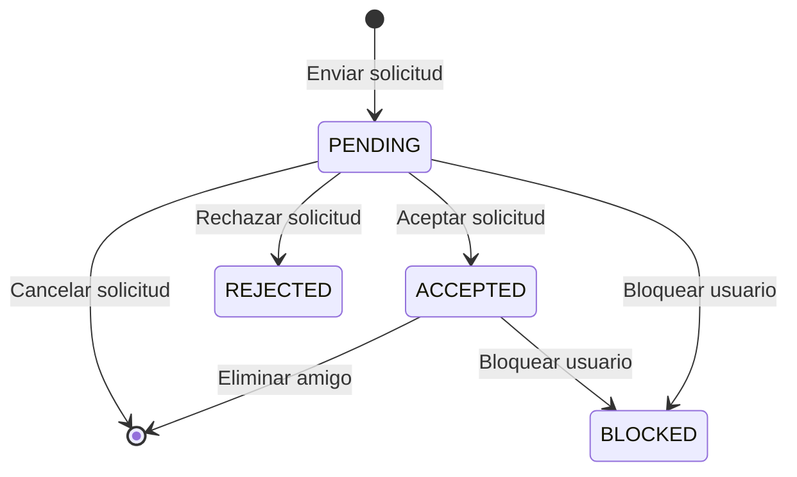
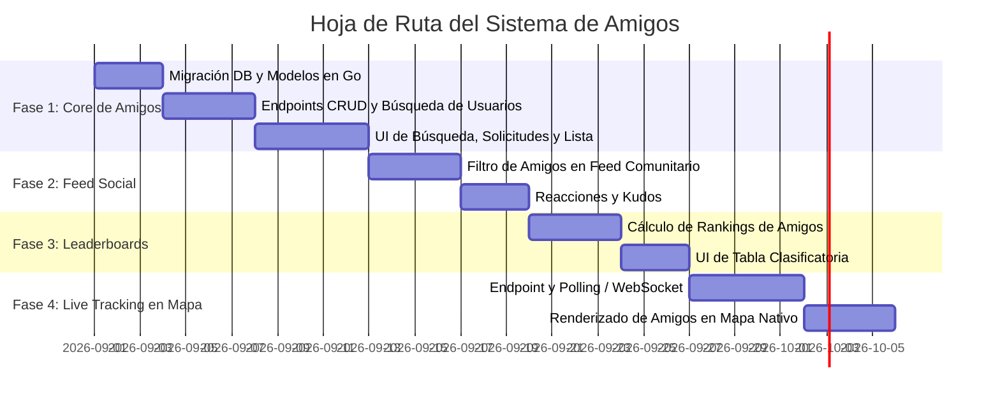

# Sistema de Amigos y Funcionalidades Sociales (Ski Tracker)

Este documento describe la arquitectura, diseño funcional y hoja de ruta para la implementación del **Sistema de Amigos y Comunidad** en la aplicación Ski Tracker.

---

## 🎯 1. Visión y Casos de Uso

El esquí es una actividad eminentemente grupal y social. El sistema de amigos está estructurado en torno a **3 pilares fundamentales**:



### A. En Pistas y Tiempo Real (Live Tracking & Seguridad)
* **Amigos en el Mapa Interactivo:** Visualización en tiempo real (o casi real) de los amigos que estén esquiando en la misma estación de esquí.
* **Puntos de Encuentro:** Marcador en el mapa fijado por un usuario (ej. *"Cafetería Borreguiles a las 14:00"*) visible para su grupo.
* **Alertas y Estado:** Indicador de estado (Esquiando, En remonte, En descanso, Alerta de asistencia).

### B. Feed Social & Comunidad
* **Feed de Actividad:** Registro cronológico de sesiones subidas por amigos con resumen de métricas (desnivel, km, velocidad punta, fotos y mapa del track).
* **Interacciones:** Reacciones (*Kudos* 🔥, *Applause* 👏) y comentarios en las sesiones.

### C. Gamificación y Tablas de Clasificación (Leaderboards)
* **Rankings de Amigos:**
  * Mayor distancia recorrida en la temporada / fin de semana.
  * Mayor desnivel negativo esquiado.
  * Pistas completadas por dificultad (verdes, azules, rojas, negras).

---

## 👥 2. Ciclo de Vida de la Amistad y Privacidad

### Estados de la Relación
* `PENDING`: Solicitud de amistad enviada y a la espera de aprobación.
* `ACCEPTED`: Amistad confirmada bidireccional.
* `REJECTED`: Solicitud rechazada.
* `BLOCKED`: Usuario bloqueado (no aparece en búsquedas ni puede enviar solicitudes).



### Configuración de Privacidad del Usuario
Cada usuario podrá configurar en su perfil:
* **Visibilidad de Sesiones:** `Pública` (todos), `Solo Amigos` (predeterminado), `Privada` (solo el autor).
* **Compartir Ubicación en Vivo:** `Activada` (amigos en la misma estación ven el pin), `Solo mientras grabo sesión`, `Desactivada (Modo Fantasma)`.
* **Permitir solicitudes:** `Todos`, `Nadie`.

---

## 🗄️ 3. Modelo de Datos y Base de Datos (PostgreSQL / Bun)

### Tabla `friendships`
Almacena la relación y estado entre dos usuarios:

```sql
CREATE TABLE friendships (
    id UUID PRIMARY KEY DEFAULT gen_random_uuid(),
    requester_id UUID NOT NULL REFERENCES users(id) ON DELETE CASCADE,
    addressee_id UUID NOT NULL REFERENCES users(id) ON DELETE CASCADE,
    status VARCHAR(20) NOT NULL DEFAULT 'PENDING', -- PENDING, ACCEPTED, REJECTED, BLOCKED
    created_at TIMESTAMP WITH TIME ZONE DEFAULT CURRENT_TIMESTAMP,
    updated_at TIMESTAMP WITH TIME ZONE DEFAULT CURRENT_TIMESTAMP,
    CONSTRAINT unique_friendship_pair UNIQUE (requester_id, addressee_id)
);

CREATE INDEX idx_friendships_requester ON friendships(requester_id, status);
CREATE INDEX idx_friendships_addressee ON friendships(addressee_id, status);
```

### Tabla `session_interactions` (Opcional - Fase 2)
Almacena reacciones y comentarios en sesiones:

```sql
CREATE TABLE session_reactions (
    id UUID PRIMARY KEY DEFAULT gen_random_uuid(),
    session_id UUID NOT NULL REFERENCES ski_sessions(id) ON DELETE CASCADE,
    user_id UUID NOT NULL REFERENCES users(id) ON DELETE CASCADE,
    reaction_type VARCHAR(20) NOT NULL, -- 'fire', 'like', 'ski'
    created_at TIMESTAMP WITH TIME ZONE DEFAULT CURRENT_TIMESTAMP,
    CONSTRAINT unique_user_session_reaction UNIQUE (session_id, user_id)
);
```

---

## 🔌 4. API Backend (Golang API)

### Endpoints de Gestión de Amigos

| Método | Endpoint | Descripción |
| :--- | :--- | :--- |
| `GET` | `/api/v1/friends` | Obtiene la lista de amigos confirmados del usuario autenticado. |
| `GET` | `/api/v1/friends/requests` | Obtiene solicitudes pendientes (entrantes y salientes). |
| `POST` | `/api/v1/friends/request` | Envía una solicitud de amistad (`addressee_id` o `username`). |
| `POST` | `/api/v1/friends/respond` | Acepta o rechaza una solicitud recibida (`friendship_id`, `action: accept/reject`). |
| `DELETE` | `/api/v1/friends/:id` | Elimina una amistad existente. |
| `POST` | `/api/v1/friends/block/:userId` | Bloquea a un usuario. |
| `GET` | `/api/v1/users/search?q={query}` | Busca usuarios por nombre de usuario o email. |

### Endpoints de Actividad y Tiempo Real

| Método | Endpoint | Descripción |
| :--- | :--- | :--- |
| `GET` | `/api/v1/friends/feed` | Listado paginado de sesiones recientes de amigos. |
| `GET` | `/api/v1/friends/leaderboard` | Clasificación entre amigos por periodo (semana, mes, temporada). |
| `GET` | `/api/v1/friends/live-locations?resort_id={id}` | Ubicación en vivo de amigos en la misma estación (si tienen Live Tracking activo). |

---

## 📱 5. Interfaz de Usuario (Frontend React Native)

1. **Sección de Amigos en Perfil y Comunidad:**
   - Buscador de usuarios con debounce en tiempo real.
   - Pestaña de solicitudes entrantes con botones de *Aceptar* / *Rechazar* y badge numérico de pendientes.
   - Lista de amigos con avatar, nombre, última estación visitada y total de km esquiados.
2. **Feed de Comunidad Mejorado (`community.tsx`):**
   - Selector de visualización: *Global* vs *Amigos*.
   - Tarjetas de sesión de amigos con mapa estático, estadísticas destacadas y galería de fotos.
3. **Capa en Mapa de Tracking (`tracking.native.tsx` / `map.native.tsx`):**
   - Capa de marcadores `NativeMarker` con avatares circulares de amigos en vivo en la misma estación.

---

## 🗓️ 6. Hoja de Ruta de Implementación


