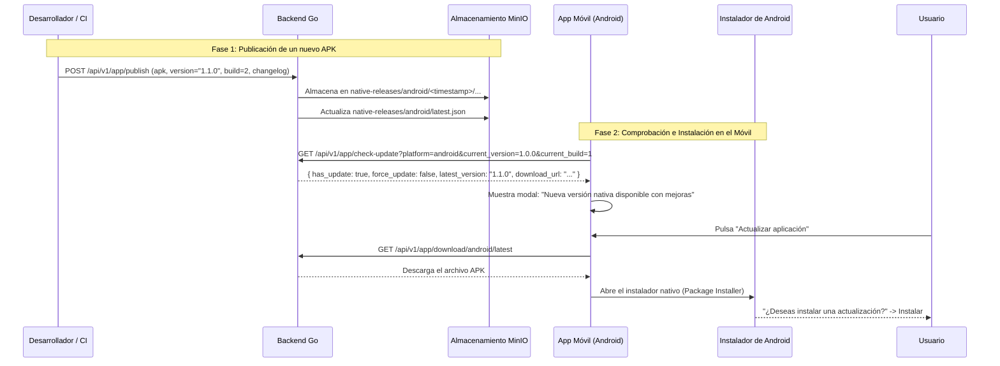

# Sistema de Actualizaciones Nativas de la Aplicación (APKs)

Este documento describe la arquitectura, endpoints y flujo de trabajo para gestionar y distribuir **actualizaciones nativas de la aplicación (archivos `.apk` para Android)** directamente desde nuestro propio backend (alojado en MinIO), antes de dar el salto a la Google Play Store.

---

## 🧭 1. OTA Updates vs. Actualizaciones Nativas (APK)

En Ski Tracker coexisten dos tipos de actualizaciones complementarias:

| Característica | Actualizaciones OTA (`/api/v1/ota/*`) | Actualizaciones Nativas (`/api/v1/app/*`) |
| :--- | :--- | :--- |
| **¿Qué actualiza?** | Código TypeScript/React, estilos, iconos, traducciones y componentes UI. | Nuevas librerías nativas en Java/Kotlin (ej. `expo-camera`, `expo-file-system`), permisos en `AndroidManifest.xml`. |
| **¿Requiere nuevo APK?** | **No**. Se descarga y recarga al instante al abrir la app. | **Sí**. Requiere compilar e instalar un nuevo archivo `.apk`. |
| **Intervención del usuario** | Automática o mediante modal informativo. | Android solicita confirmación de actualización mediante el instalador nativo. |
| **Frecuencia** | Frecuente (despliegue continuo de parches y mejoras). | Ocasional (cuando se agregan capacidades del hardware o dependencias nativas). |

---

## 🏗️ 2. Arquitectura del Sistema de Actualizaciones Nativas



---

## 🔌 3. Endpoints del Backend (Golang API)

### 3.1 Comprobación de Versión (`GET /api/v1/app/check-update`)
Utilizado por la app al iniciarse para verificar si existe un APK más reciente que el instalado.

* **Parámetros de consulta (Query):**
  * `platform`: `android` o `ios` (por defecto `android`).
  * `current_version`: Versión actual instalada (ej. `1.0.0`).
  * `current_build`: Número de compilación entero (ej. `1`).

* **Respuesta (`200 OK`):**
```json
{
  "has_update": true,
  "force_update": false,
  "current_version": "1.0.0",
  "current_build": 1,
  "latest_version": "1.1.0",
  "latest_build_number": 2,
  "download_url": "https://api-ski-tracker.viti-tech.es/api/v1/app/download/android/latest",
  "changelog": {
    "es": [
      "Soporte para guardado nativo de fotos en galería",
      "Mejoras de rendimiento en el mapa de tracking"
    ],
    "en": [
      "Support for native gallery photo saving",
      "Performance improvements on tracking map"
    ]
  },
  "file_size": 48234567,
  "released_at": "2026-08-27T13:30:00Z"
}
```

---

### 3.2 Descarga del APK (`GET /api/v1/app/download/:platform/latest`)
Transmite directamente el binario `.apk` desde MinIO con las cabeceras de descarga de Android:
* `Content-Type: application/vnd.android.package-archive`
* `Content-Disposition: attachment; filename="ski-tracker-android-v1.1.0.apk"`

---

### 3.3 Información de la Última Versión (`GET /api/v1/app/latest`)
Devuelve la información JSON completa del último release publicado para la plataforma.

---

### 3.4 Publicar un Nuevo Release (`POST /api/v1/app/publish`)
*Protegido mediante token de publicación o JWT de administrador.*

* **Cuerpo de la petición (`multipart/form-data`):**
  * `apk`: Archivo binario `.apk` generado.
  * `version`: Cadena de versión (ej. `1.1.0`).
  * `build_number`: Número entero de compilación (ej. `2`).
  * `platform`: `android` (por defecto) o `ios`.
  * `force_update`: `true` o `false`.
  * `changelog`: JSON con mensajes por idioma (`{"es":["..."],"en":["..."]}`).

* **Ejemplo con cURL:**
```bash
curl -X POST https://api-ski-tracker.viti-tech.es/api/v1/app/publish \
  -H "Authorization: Bearer <TU_OTA_SECRET>" \
  -F "apk=@apps/web/build-output/app-release.apk" \
  -F "version=1.1.0" \
  -F "build_number=2" \
  -F "force_update=false" \
  -F "changelog={\"es\":[\"Nueva funcionalidad de amigos\",\"Corrección en fotos\"],\"en\":[\"New friends feature\",\"Photo fix\"]}"
```

---

## 📱 4. Integración en la App Móvil (React Native / Expo)

Para comprobar e instalar el APK dentro de la app:

1. **Obtener la versión actual:**
   ```typescript
   import * as Application from 'expo-application';

   const currentVersion = Application.nativeApplicationVersion; // ej. "1.0.0"
   const currentBuild = Application.nativeBuildVersion;         // ej. "1"
   ```

2. **Comprobar actualización al iniciar:**
   ```typescript
   const checkNativeUpdate = async () => {
     const response = await api.get('/app/check-update', {
       params: {
         platform: Platform.OS,
         current_version: currentVersion,
         current_build: currentBuild,
       }
     });

     if (response.data.has_update) {
       // Mostrar modal informativo con el changelog y botón de actualizar
       setUpdateModalData(response.data);
     }
   };
   ```

3. **Descargar e iniciar la instalación:**
   Al pulsar **"Actualizar"**, se abre el enlace directo de descarga en el navegador o se descarga y ejecuta el Package Installer de Android:
   ```typescript
   import { Linking } from 'react-native';

   const handleDownloadAndInstall = () => {
     Linking.openURL(updateModalData.download_url);
   };
   ```

---

## 🚀 5. Plan de Transición Futura a Google Play Store

Cuando decidas lanzar la aplicación al público general:

1. **Creación de Cuenta:** Registro único en **Google Play Console** (25 USD).
2. **Generación de AAB:** Compilar con formato Android App Bundle (`.aab`) en lugar de `.apk`:
   ```bash
   eas build --platform android --profile production
   ```
3. **Compatibilidad:**
   - La app seguirá utilizando el sistema **OTA** propio para actualizaciones de código React Native instantáneas.
   - Las actualizaciones nativas se gestionarán a través de las actualizaciones automáticas de Google Play Store.
