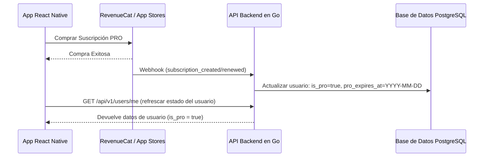

# Arquitectura del Plan PRO y Sistema de Licencias

Este documento describe el diseño de la arquitectura para implementar un **Plan PRO (Suscripción de Pago)** en la aplicación Ski Tracker. El plan PRO desbloqueará funciones premium, como la subida de fotos a las sesiones de esquí.

---

## 1. Opciones de Suscripción y Licenciamiento

Para una aplicación React Native (Expo) con backend en Go, existen dos enfoques principales para gestionar suscripciones:

### Opción A: RevenueCat (Recomendada)
RevenueCat abstrae las compras integradas de Apple App Store (IAP) y Google Play Billing, proporcionando un único SDK para el cliente y eventos mediante webhooks para el backend.
* **Ventajas:** Gestiona casos complejos (validación de recibos, periodos de prueba, estados de suscripción, cancelaciones) de forma automática. No requiere código de integración específico por plataforma.
* **Desventajas:** Pequeña comisión a partir de cierto volumen de ingresos mensuales.

### Opción B: Integración Directa (StoreKit / Google Play Billing + Stripe)
Integrar directamente StoreKit de Apple, Google Play Billing, o usar Stripe para una versión web.
* **Ventajas:** Sin comisiones de procesamiento a terceros (más allá de las comisiones estándar de las tiendas).
* **Desventajas:** Muy complejo de implementar, mantener y asegurar (gestión de tokens, reembolsos, sincronización de estados).

---

## 2. Cambios en el Esquema de Base de Datos

Se ampliará la tabla `users` en la base de datos para almacenar el estado de suscripción del usuario.

### Esquema de Migración (Golang Bun / PostgreSQL)
```go
type User struct {
    bun.BaseModel `bun:"table:users,alias:u"`

    // Campos existentes...
    ID           uuid.UUID `bun:"id,pk,default:gen_random_uuid()" json:"id"`
    
    // Nuevos campos PRO
    IsPro                 bool       `bun:"is_pro,default:false" json:"is_pro"`
    ProExpiresAt          *time.Time `bun:"pro_expires_at" json:"pro_expires_at,omitempty"`
    SubscriptionProvider  string     `bun:"subscription_provider" json:"subscription_provider,omitempty"` // "apple", "google", "stripe", "revenuecat"
    SubscriptionID        string     `bun:"subscription_id" json:"subscription_id,omitempty"`
}
```

---

## 3. Arquitectura del Backend (API en Golang)

El backend debe realizar tres tareas principales:
1. Verificar el estado PRO del usuario cuando realiza acciones premium.
2. Recibir Webhooks seguros de la pasarela de pagos (RevenueCat/Stripe) para actualizar los estados de suscripción.
3. Exponer un endpoint para que el cliente pueda refrescar o restaurar suscripciones manualmente.



### 3.1 Middleware de Verificación PRO
Implementamos un middleware en Go para proteger endpoints premium (por ejemplo, subida de fotos).

```go
package middleware

import (
	"net/http"
	"time"

	"github.com/gin-gonic/gin"
	"github.com/victorgomez09/ski-tracker/internal/httputil"
)

func RequirePRO() gin.HandlerFunc {
	return func(c *gin.Context) {
		// Se asume que el usuario ya fue cargado en el contexto por AuthMiddleware
		userVal, exists := c.Get("currentUser")
		if !exists {
			httputil.RespondUnauthorized(c)
			return
		}
		
		user := userVal.(*models.User)
		
		// Validar si el usuario tiene un estado PRO activo
		if !user.IsPro || (user.ProExpiresAt != nil && user.ProExpiresAt.Before(time.Now())) {
			c.JSON(http.StatusPaymentRequired, gin.H{
				"error": "pro_plan_required",
				"message": "Esta funcionalidad requiere una suscripción PRO activa.",
			})
			c.Abort()
			return
		}
		
		c.Next()
	}
}
```

---

## 4. Arquitectura Frontend (React Native / Expo)

En el cliente, se requiere controlar si el usuario es PRO, mostrar un Paywall cuando intente acceder a funcionalidades premium y gestionar verificaciones offline.

### 4.1 Actualización del Contexto Global de Usuario
Guardamos el estado `isPro` en el contexto global de usuario.

```typescript
// apps/web/context/user.context.tsx
export interface User {
  id: string;
  email: string;
  is_pro: boolean;
  pro_expires_at?: string;
  // ...otros campos
}
```

### 4.2 Restricción de Funcionalidades Premium (Protección en UI)
Para limitar acciones de subida, se muestra condicionalmente el bloqueo premium:

```tsx
import React from 'react';
import { View, Button, Text, Alert } from 'react-native';
import { useUser } from '../context/user.context';

export const PhotoUploadSection = () => {
  const { user } = useUser();

  const handleUploadPhoto = () => {
    if (!user?.is_pro) {
      Alert.alert(
        "Funcionalidad PRO",
        "Subir fotos a tus sesiones de esquí es una función PRO. ¡Actualiza tu cuenta!",
        [
          { text: "Ver Planes", onPress: () => openPaywall() },
          { text: "Cancelar", style: "cancel" }
        ]
      );
      return;
    }

    // Continuar con la lógica de subida...
  };

  return (
    <View>
      <Button title="Añadir Foto" onPress={handleUploadPhoto} />
      {!user?.is_pro && <Text style={{ fontSize: 10, color: 'gray' }}>Solo PRO</Text>}
    </View>
  );
};
```

---

## 5. Consideraciones para Modo Offline

Dado que el esquí se practica en entornos de montaña con cobertura limitada o nula:
1. **Caché del Estado de Suscripción:** Guardar localmente `is_pro` y `pro_expires_at` en `Expo.SecureStore` o `AsyncStorage` cuando la aplicación esté conectada.
2. **Validación de Expiración Offline:** Si el usuario no tiene conexión, validar la fecha de caducidad almacenada en local en lugar de consultar a la API:
    ```typescript
    const isProOffline = (cachedUser: User | null): boolean => {
      if (!cachedUser?.is_pro) return false;
      if (!cachedUser.pro_expires_at) return true; // compra vitalicia
      return new Date(cachedUser.pro_expires_at) > new Date();
    };
    ```
3. **Buffer Local:** Si el usuario es PRO y toma fotos sin conexión, encolar la subida en SQLite y sincronizarla cuando se recupere la conexión, validando el token en ese momento.

---

## 6. Funcionalidades Incluidas en el Plan PRO

1. Subida de fotos a las sesiones de esquí.
2. Descarga de mapas offline.
3. Previsiones meteorológicas detalladas y avanzadas.
4. Mayor nivel de detalle y zoom en pistas.
5. Actualizaciones prioritarias.