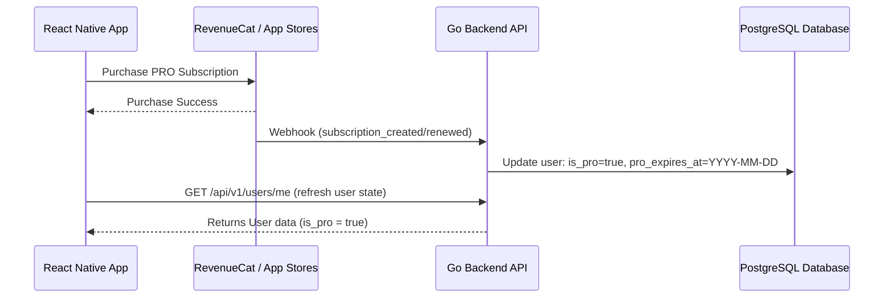

# PRO Plan & Licensing System Architecture

This document describes the architectural design for implementing a **PRO Plan (Paid Subscription)** in the Ski Tracker application. The PRO plan will unlock premium features, such as uploading photos to ski sessions.

---

## 1. Subscription & Licensing Options

For a React Native (Expo) app with a Go backend, there are two primary approaches to handling subscriptions:

### Option A: RevenueCat (Recommended)
RevenueCat abstracts Apple App Store (IAP) and Google Play Billing, providing a single SDK for the client and webhook events for the backend.
*   **Pros:** Handles edge cases (receipt validation, trial periods, subscription states, cancellations) automatically. No need to write platform-specific integration code.
*   **Cons:** Small fee after a certain monthly revenue threshold.

### Option B: Direct Integration (StoreKit / Google Play Billing + Stripe)
Integrating Apple's StoreKit, Google Play Billing directly, or using Stripe for a web version.
*   **Pros:** Free of third-party processing fees (excluding standard platform cuts).
*   **Cons:** Extremely complex to implement, maintain, and secure (handling token validation, refunds, subscription updates).

---

## 2. Database Schema Changes

We will extend the `users` table in the database to store the user's subscription status.

### Migration Schema (Golang Bun / PostgreSQL)
```go
type User struct {
    bun.BaseModel `bun:"table:users,alias:u"`

    // Existing fields...
    ID           uuid.UUID `bun:"id,pk,default:gen_random_uuid()" json:"id"`
    
    // New PRO Fields
    IsPro                 bool       `bun:"is_pro,default:false" json:"is_pro"`
    ProExpiresAt          *time.Time `bun:"pro_expires_at" json:"pro_expires_at,omitempty"`
    SubscriptionProvider  string     `bun:"subscription_provider" json:"subscription_provider,omitempty"` // "apple", "google", "stripe", "revenuecat"
    SubscriptionID        string     `bun:"subscription_id" json:"subscription_id,omitempty"`
}
```

---

## 3. Backend Architecture (Golang API)

The backend needs to do three things:
1.  Verify the user's PRO status when they perform premium actions.
2.  Receive secure Webhooks from the payment processor (RevenueCat/Stripe) to update subscription statuses.
3.  Expose an endpoint for the client to manually refresh or restore subscriptions.



### 3.1 PRO Verification Middleware
We will introduce a simple Go middleware to protect premium endpoints (e.g., uploading photos).

```go
package middleware

import (
	"net/http"
	"time"

	"github.com/gin-gonic/gin"
	"github.com/victorgomez09/ski-tracker/internal/httputil"
)

func RequirePRO() gin.HandlerFunc {
	return func(c *gin.Context) {
		// Assume user is already loaded in context by AuthMiddleware
		userVal, exists := c.Get("currentUser")
		if !exists {
			httputil.RespondUnauthorized(c)
			return
		}
		
		user := userVal.(*models.User)
		
		// Validate if user has an active PRO status
		if !user.IsPro || (user.ProExpiresAt != nil && user.ProExpiresAt.Before(time.Now())) {
			c.JSON(http.StatusPaymentRequired, gin.H{
				"error": "pro_plan_required",
				"message": "This feature requires an active PRO subscription.",
			})
			c.Abort()
			return
		}
		
		c.Next()
	}
}
```

---

## 4. Frontend Architecture (React Native / Expo)

On the client side, we need to track if the user is PRO, display a Paywall when they attempt to use premium features, and handle offline checks.

### 4.1 Global User Context Update
We will store the `isPro` status inside our global user state.

```typescript
// apps/web/context/user.context.tsx
export interface User {
  id: string;
  email: string;
  is_pro: boolean;
  pro_expires_at?: string;
  // ...other fields
}
```

### 4.2 Restricting Premium Features (UI Guard)
To restrict upload operations, we conditionally show premium limits:

```tsx
import React from 'react';
import { View, Button, Text, Alert } from 'react-native';
import { useUser } from '../context/user.context';

export const PhotoUploadSection = () => {
  const { user } = useUser();

  const handleUploadPhoto = () => {
    if (!user?.is_pro) {
      Alert.alert(
        "PRO Feature",
        "Uploading photos to your ski sessions is a PRO feature. Upgrade now!",
        [
          { text: "View Plans", onPress: () => openPaywall() },
          { text: "Cancel", style: "cancel" }
        ]
      );
      return;
    }

    // Proceed with upload logic...
  };

  return (
    <View>
      <Button title="Add Photo" onPress={handleUploadPhoto} />
      {!user?.is_pro && <Text style={{ fontSize: 10, color: 'gray' }}>PRO Only</Text>}
    </View>
  );
};
```

---

## 5. Offline Considerations

Since skiing happens in the mountains with limited or no connectivity:
1.  **Cache Subscription Status:** Store the `is_pro` and `pro_expires_at` locally inside `Expo.SecureStore` or `AsyncStorage` when the app is online.
2.  **Offline Expiry Checks:** If the user is offline, check the locally cached expiration date rather than calling the API:
    ```typescript
    const isProOffline = (cachedUser: User | null): boolean => {
      if (!cachedUser?.is_pro) return false;
      if (!cachedUser.pro_expires_at) return true; // lifetime purchase
      return new Date(cachedUser.pro_expires_at) > new Date();
    };
    ```
3.  **Local Buffering:** If the user is PRO and uploads a photo offline, queue the upload in SQLite and sync it when connection is restored, verifying the token then.


## 6. Features included in PRO plan

1. Add photos to ski session
2. Offline maps?
3. Detailed weather reports
4. Zoom details?
5. Priority updates